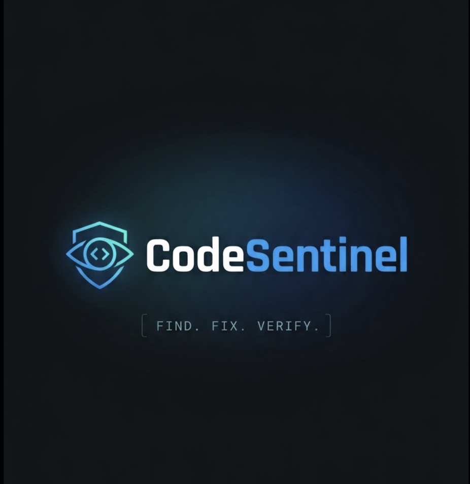

<p align="center"></p>

# CodeSentinel 🛡️

**A local MCP security auditor with controlled remediation and independent verification.**

`TypeScript` · `MCP over stdio`

## What is CodeSentinel?

CodeSentinel inspects a selected local project for supported security findings and exposes investigation, remediation, and verification tools through MCP. It connects source evidence to proposed changes, explicit authorization, validation, and independent retesting.

### Why CodeSentinel?

A proposed fix is not a verified result. CodeSentinel keeps those stages separate: a successful write remains `validated_pending_retest`, and a fresh sweep checks for remaining and newly introduced findings.

## Key features

- **Read-only analysis:** project discovery, rule-backed scanning, route/access analysis, and deeper audits.
- **Evidence and coverage:** static findings, heuristic review signals, runtime proof, and unsupported domains are reported separately.
- **Controlled changes:** finding-linked proposals, authorization checks, dry runs, and guarded file writes.
- **Verification and recovery:** independent retesting, fresh security sweeps, and hash-checked rollback.

## How it works

Select a project with an absolute `projectRoot`, inspect the findings, then investigate a specific issue before proposing a change. Remediation is intended for explicitly authorized local, non-production test targets.

### Workflow

```text
FIND
  ↓
INVESTIGATE
  ↓
PROPOSE
  ↓
AUTHORIZE
  ↓
DRY RUN
  ↓
APPLY
  ↓
VALIDATE
  ↓
RETEST
  ↓
SWEEP
```

**Rollback** is available separately when needed. It restores recorded original bytes only if project, state, and file-hash checks pass; it refuses to overwrite unexpected newer changes.

## Installation

Use Git, npm, and Node.js 22.12 or later within the Node.js 22 release line. The current test dependencies also accept Node.js 24 and 26 or later.

```sh
git clone https://github.com/KeshavKandoi/CodeSentinel.git
cd CodeSentinel
npm ci
npm run build
```

Run these commands from the cloned repository root, where `package.json` lives. The stdio MCP entrypoint is `dist/index.js`; use its absolute path in client configuration.

## MCP setup

### Claude Code

```sh
claude mcp add --transport stdio codesentinel -- node /absolute/path/to/CodeSentinel/dist/index.js
claude mcp list
```

### Codex

```sh
codex mcp add codesentinel -- node /absolute/path/to/CodeSentinel/dist/index.js
codex mcp list
```

`PROJECT_ROOT` is an optional server default. Tools accepting `projectRoot` use the explicit absolute path in preference to that default. Investigation sessions retain their selected project scope. The server process must be able to access the selected files.

## Quick start

Ask your MCP client to call `scan_project` with:

```json
{"projectRoot":"/absolute/path/to/project"}
```

Inspect finding IDs, rule IDs, evidence, and coverage. Use `run_full_security_audit` with the same `projectRoot` for broader analysis. Missing runtime prerequisites produce blocked or inconclusive verification, not a clean security result.

### Example finding and remediation flow

The [built-MCP regression test](./tests/mcp.proposalContract.integration.test.ts) exercises a genuine `CS-NODE-009` object-authorization indicator in a disposable Git fixture:

1. Scan, then use `start_security_investigation` and `run_security_analysis` to investigate the issue.
2. Call `propose_remediation` using the investigation finding ID. Its `files` array contains structured objects with `path`, `originalContentHash`, `proposedContent`, and `description`—not path strings.
3. Pass the proposal ID as `remediationId` to `apply_remediation`, with explicit authorization and `dryRun: true`. Review the result before a separate `dryRun: false` call.
4. After validation, call `retest_finding` for the original scan finding, then `security_remediation_sweep` to check remaining and new findings.
5. If restoration is needed, call `rollback_remediation` with the same project scope and authorization.

This test demonstrates resolution of a supported static indicator; it does not establish that all authorization behavior is secure. See the [tool registry](./src/tools/registry.ts) for complete input schemas.

## Security & safety model

- **Explicit authorization:** apply and rollback require an authorization object naming the exact canonical root:

  ```json
  {
    "projectRoot": "/absolute/path/to/project",
    "localTarget": true,
    "allowRemediation": true,
    "nonProductionTestTarget": true
  }
  ```

- **Project isolation:** path containment, symlink protections, Git cleanliness, and original/current hash checks guard writes and rollback. Cross-project remediation IDs are rejected.
- **Read-only source analysis:** scan, audit, investigation, dry run, retest, and sweep do not modify target source files. Runtime verification can send requests to an authorized local application; use an isolated instance with synthetic data.
- **Evidence before resolution:** successful apply is not `resolved`. Independent retesting is required; blocked, unsupported, and inconclusive outcomes remain explicit. Sweep reports new findings separately.
- **Safe rollback:** recorded original bytes and hashes are checked, unexpected post-write changes are rejected, and repeated rollback is rejected.

## Supported coverage

The security scanner currently runs `CS-NODE-001` through `CS-NODE-025` for detected Node.js projects. Supported checks include credential exposure, injection, unsafe paths and requests, access-control indicators, and security configuration. See the [rule registry](./src/security/ruleRegistry.ts) and [rule implementations](./src/security/rules).

Discovery and route analysis recognize additional stacks; that does **not** imply equivalent security-rule or runtime-proof coverage. Rule-backed static findings are candidates, heuristic signals are review prompts, and runtime-proven findings require separate execution evidence.

## Current limitations

- An empty scan does not prove an application secure. Coverage is limited to implemented rules and analysis adapters.
- CodeSentinel cannot automatically fix every vulnerability. The controlled proposal/apply path supports one finding file at a time.
- Runtime proof needs an authorized target and a supported proof path. Findings can remain unsupported or inconclusive.
- Investigation and remediation state is held in memory. Keep the server session running for the lifecycle, including rollback; records do not survive a restart.

## Development

Install and build as above. For tests, create `.env` from the placeholder file if you do not already have one:

```sh
cp -n .env.example .env
```

Populate its `CODESENTINEL_TEST_*` variables with **synthetic, nonfunctional values** matching the formats exercised by the credential/redaction tests. Never use production credentials. Vitest loads `.env`; missing required values fail explicitly. The empty example alone is not sufficient to run the suite.

```sh
npm test
npx tsc --noEmit
npm run build
git diff --check
```

Tests include built-MCP integration checks, disposable Git fixtures, and local HTTP servers; the environment must permit local loopback listeners. `npm run dev` starts the source stdio server, and `npm start` runs the built server.

## Roadmap

Potential next steps for maintainer discussion: broader rule/proof coverage, a documented synthetic test-environment bootstrap, and automated CI verification. These are proposals, not shipped capabilities or delivery commitments.

## Contributing

Keep changes focused, include regression coverage, and run the development checks before submitting a pull request. Preserve project isolation and explicit authorization. Use disposable fixtures and synthetic data; never include secrets or private target source in reports. For ordinary bugs, open an [issue](https://github.com/KeshavKandoi/CodeSentinel/issues) with a minimal, redacted reproduction.

